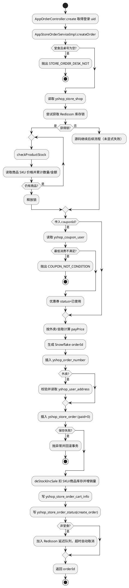
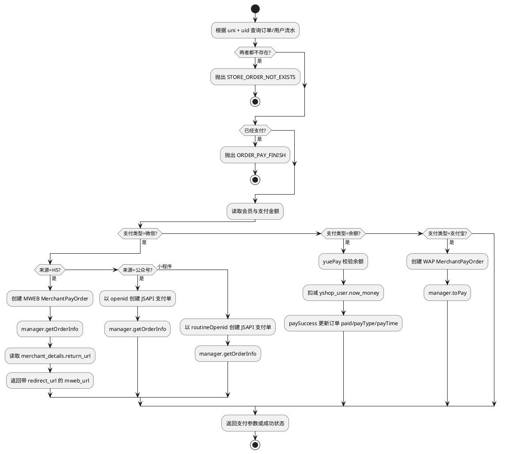
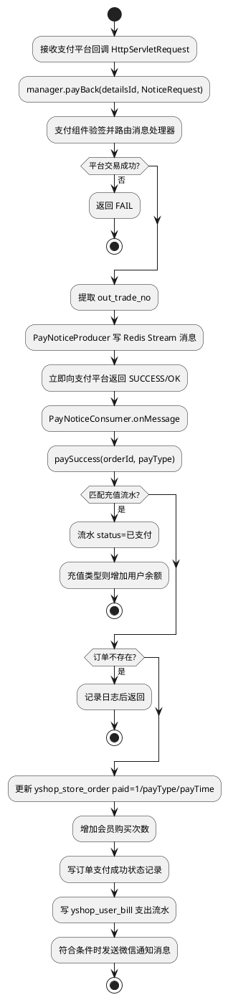
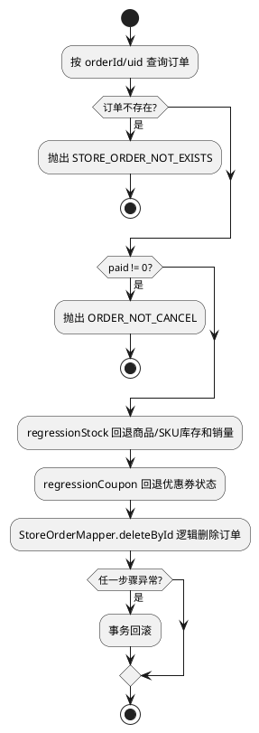
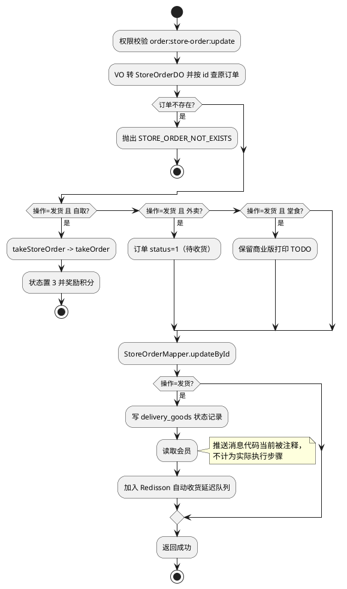
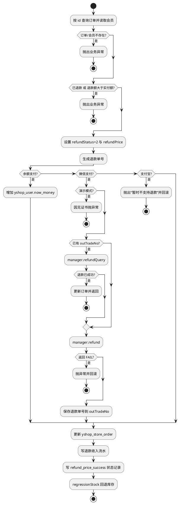

# 复杂接口运行流程

## 说明

以下流程沿真实的 `Controller → Service/ServiceImpl → Mapper/第三方组件/Redis → 数据库` 调用链整理。图中的异常分支、事务、状态字段与方法名均来自源码；注释中标为 TODO 或被注释掉的商业版能力，没有写成已执行步骤。

## 1. 创建订单

- 请求：`POST /app-api/order/create`
- Controller：`AppOrderController#create`
- 核心 Service：`AppStoreOrderServiceImpl#createOrder`（`@Transactional`）
- 目的：校验商品与库存，计算价格/优惠，落订单及明细并安排超时取消。

## 2. 发起订单支付

- 请求：`POST /app-api/order/pay`
- Controller：`AppOrderController#pay`
- 核心 Service：`AppStoreOrderServiceImpl#pay`；余额分支进入 `yuePay`、`paySuccess`
- 第三方：`PayServiceManager`

## 3. 支付回调与异步落账

- 请求：`ANY /app-api/order/notify/payBack{detailsId}.json`（源码使用未限定 method 的 `@RequestMapping`）
- Controller：`AppOrderController#payBack`
- 核心链路：`PayServiceManager#payBack` → `WxPayMessageHandler`/`AliPayMessageHandler` → `PayNoticeProducer` → `PayNoticeConsumer` → `AppStoreOrderServiceImpl#paySuccess`

## 4. 取消未支付订单

- 请求：`POST /app-api/order/cancel`
- Controller：`AppOrderController#cancelOrder`
- 核心 Service：`AppStoreOrderServiceImpl#cancelOrder`（`@Transactional`）

## 5. 管理端更新/发货订单

- 请求：`PUT /admin-api/order/store-order/update`
- Controller：`StoreOrderController#updateStoreOrder`
- 核心 Service：`StoreOrderServiceImpl#updateStoreOrder`

## 6. 管理端确认退款

- 请求：`POST /admin-api/order/store-order/refund`
- Controller：`StoreOrderController#refund`
- 核心 Service：`StoreOrderServiceImpl#orderRefund`（`@Transactional`）
- 第三方：`PayServiceManager#refundQuery`、`refund`

## 关键源码证据

- `.../controller/app/order/AppOrderController.java`
- `.../service/storeorder/AppStoreOrderServiceImpl.java`
- `.../controller/admin/storeorder/StoreOrderController.java`
- `.../service/storeorder/StoreOrderServiceImpl.java`
- `yshop-module-pay-api/.../config/handlers/WxPayMessageHandler.java`
- `yshop-module-pay-api/.../config/handlers/AliPayMessageHandler.java`
- `.../mq/consumer/PayNoticeConsumer.java`
