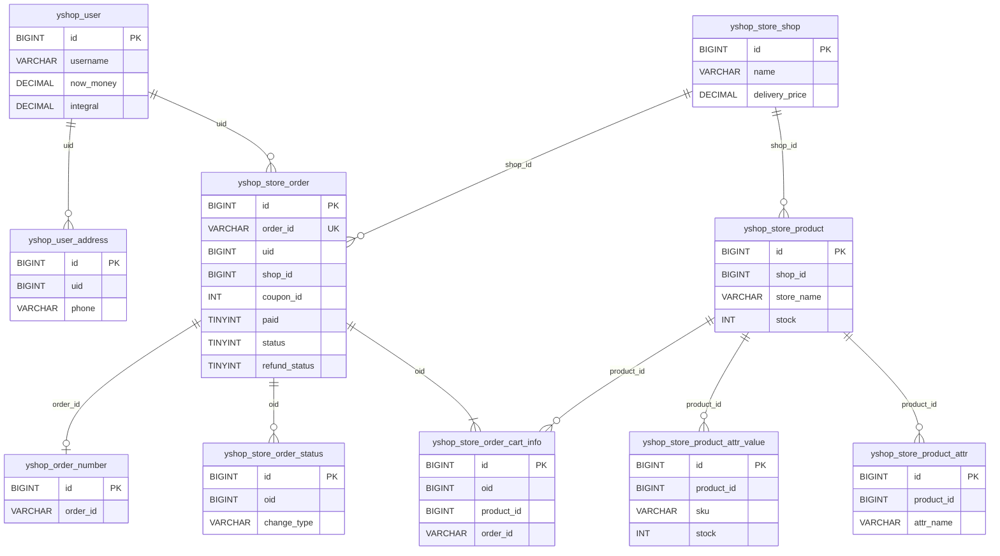
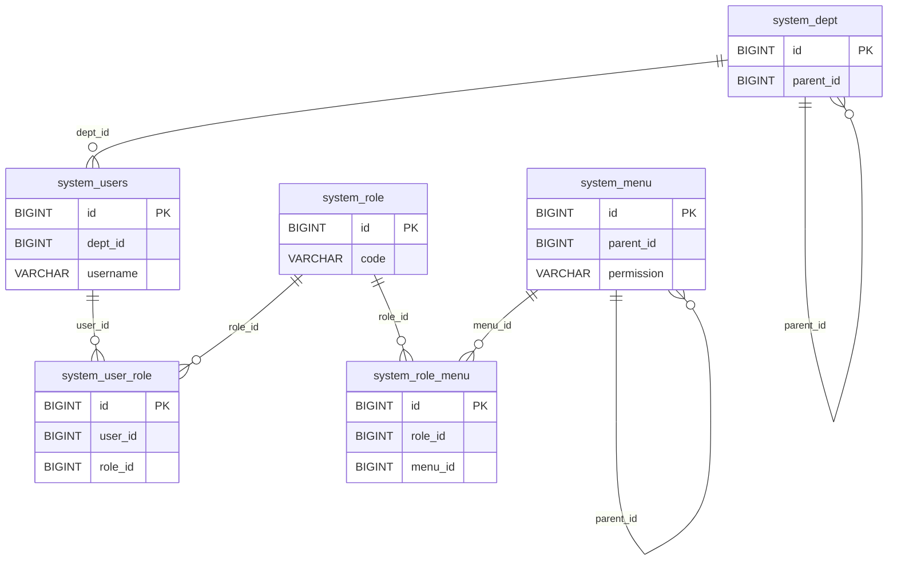
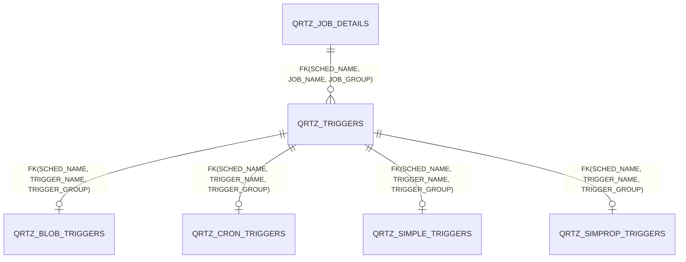

# 数据库 ER 图

## 结论与范围

- 共从 5 个 SQL 文件中解析到 **98 张去重后的表**，完整清单见 `数据表.tsv`。
- 主初始化脚本 `yshop-drink-boot3/sql/yixiang-drink-open.sql` 只为 Quartz 表声明了 5 条真实外键；业务表主要依赖索引、字段约定和应用代码维护关系。
- 为保证图可读，本文件画出有明确约束的 Quartz 关系，以及代码中可被实体/Mapper/Service 调用验证的核心业务关系；没有为了覆盖 98 张表而制造弱推断。

> 以下部分关系根据字段命名、实体类以及业务代码推断，仅用于理解业务关系，不代表数据库实际存在外键约束。

## 核心点单业务（推断关系）

依据包括：`StoreOrderDO`、`StoreOrderCartInfoDO`、`StoreOrderStatusDO`、`StoreProductDO` 等实体的 `@TableName`/字段，以及 `AppStoreOrderServiceImpl#createOrder`、`saveCartInfo`、`getOrderInfo` 中的真实读写。

## 优惠券与积分业务（推断关系）

```mermaid
erDiagram
    yshop_user {
        BIGINT id PK
        DECIMAL integral
    }
    yshop_coupon {
        BIGINT id PK
        VARCHAR shop_id
        DECIMAL value
    }
    yshop_coupon_user {
        BIGINT id PK
        BIGINT user_id
        BIGINT coupon_id
        TINYINT status
    }
    yshop_score_product {
        BIGINT id PK
        INT score
        INT stock
    }
    yshop_score_order {
        BIGINT id PK
        BIGINT uid
        BIGINT product_id
        INT total_score
    }
    yshop_user ||--o{ yshop_coupon_user : "user_id"
    yshop_coupon ||--o{ yshop_coupon_user : "coupon_id"
    yshop_user ||--o{ yshop_score_order : "uid"
    yshop_score_product ||--o{ yshop_score_order : "product_id"
```

`createOrder` 会读取 `yshop_coupon_user` 并将 `status` 更新为已使用；取消订单时 `regressionCoupon` 回退。积分订单的 `uid`、`product_id` 与对应实体和 Service 查询一致。

## 后台权限（推断关系）

## Quartz 调度（SQL 明确外键）

这 5 条关系均直接来自初始化 SQL 的 `FOREIGN KEY ... REFERENCES`，不是字段名推断。
